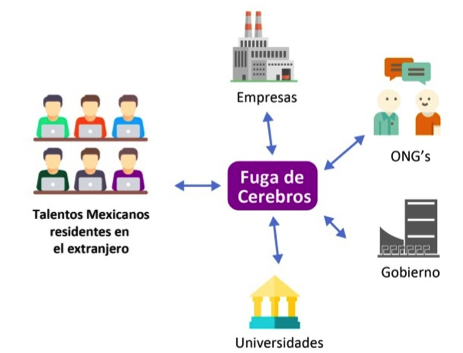
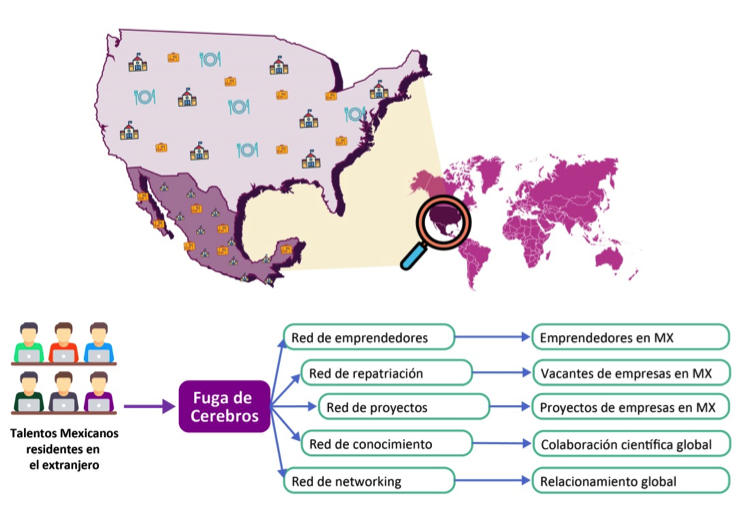
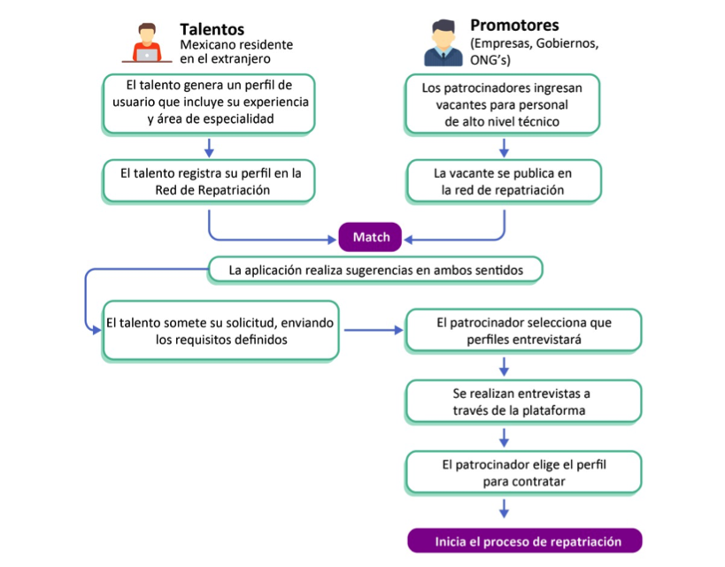
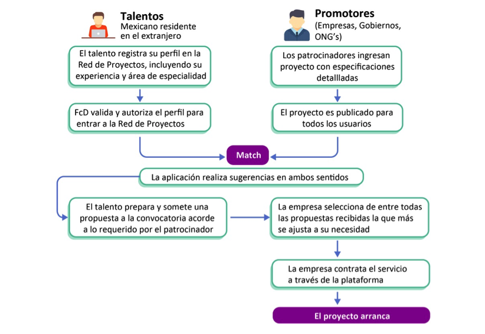

# Introducción

## Antecedentes
La fuga de cerebros (*Brain Drain*) es una realidad que afecta a los países en desarrollo, en donde personas con altos grados de educación migran hacia países desarrollados. En octubre de 2016, el Banco Mundial publicó el estudio *Global Talent Flows* [@global-talent-flows]^[Puedes visitar el [Working Paper Summaries](http://hbswk.hbs.edu/item/global-talent-flows) en **Harvard Business School**.] que destaca que entre 1990 a 2010, se ha incrementado en un 130% la fuga de cerebros en el mundo; siendo Estados Unidos, Reino Unido, Canadá y Australia los destinos preferidos. Estados Unidos atrajo, por si sólo, un tercio de los talentos en 2010. Se observó que al 2010 residian 28 millones de migrantes altamente calificados en países pertenecientes a la OCDE. Entre las principales causas destacan: los esfuerzos de políticas públicas de los países desarrollados para atraer estos talentos, las externalidades positivas que generan estas personas en la aglomeración de habilidades, el decremento en los costos de transporte y comunicación, y el deseo de jovenes de estudiar en el extranjero. En los últimos años, Francia, Alemania y España han reforzado sus políticas para atraer talentos.

Las principales localidades atractoras de talentos en Estados Unidos se concentran en el sur de California, Sillicon Valey y la ciudad de Nueva York, destacando su competencia en ciencias, tecnología, ingeniería y matemáticas. Los principales países que expulsan talentos son la India (2.1 millones), Filipinas (1.5 millones) y China (1.4 millones). Los países que han mostrado el mayor crecimiento en la migración de talentos en el período 1990 a 2010 son Algeria (954%), Rusia (910%), Bangladesh (459%), Romania (428%), Venezuela (423%), Ucrania (385%), Paquistán (380%) e India (370%).

## Motivación
El proyecto Fuga de Cerebros (FDC) surge como una propuesta para la generación de conexiones entre entre becarios y ex becarios de CONACyT que se encuentran en el extranjero, y empresas e instituciones mexicanas generadoras de proyectos que demandan profesionales altamente calificados.

FDC funcionará como un puente entre los talentos mexicanos residentes en el extranjero e instituciones generadoras de proyectos y oportunidades laborales en México a través de una plataforma digital que funcione como vínculo entre talentos mexicanos y proyectos en México. Las instituciones participantes podrán ser empresas, ONG's, dependencias públicas e instituciones académicas de grado superior, generando una red con los talentos mexicanos residiendo en el extranjero cómo se muestra en la siguiente Figura \@ref(fig:fugadecerebros).

```{r fugadecerebros, fig.cap= 'Diagrama conceptual del proyecto', echo=FALSE, fig.retina = NULL}

```
<!---->

Con la suficiente participación de Talentos e Instituciones, se generarán redes dentro de la plataforma, permitiendo que el talento, de acuerdo a su experiencia y área de especialidad, acceda a diversas oportunidades de empleo, proyectos u oportunidades de colaboración en México.  El objetivo es generar un derrame (*spillovers*) en la competitividad y productividad al ser enriquecidas por personal altamente calificado. Lo anterior producirá redes de emprendedores, repatriación, proyectos, conocimiento y networking, propagando emprendimiento, empleo, proyectos, colaboración científica y relacionamiento global como se muestra en la Figura \@ref(fig:redes).

```{r redes, fig.cap= 'Redes que generará el proyecto', echo=FALSE, fig.retina = NULL}

```
<!---->

La plataforma FDC estará compuesta por dos tipos de usuarios: talentos y promotores. Los talentos ingresarán información sobre su experiencia y especialidad técnica a manera de *Curriculum Vitae*, mientras que los Promotores lo harán para promover sus vacantes, proyectos, colaboraciones científica o algún otro fin definido para invitar a los talentos mexicanos en el extranjero que retornen al país. La plataforma generará sugerencias entre talentos y promotres, según la similitud de perfiles,  proveyendo de un canal decontacto entre los usuarios. A continuación se muestran a detalle los flujos de cómo operarían las redes de repatriación y de proyectos.

Diagrama de operación \@ref(fig:matchtalentospromotoresrepatriacion) de las redes de **repatriación** dentro de la plataforma:
```{r matchtalentospromotoresrepatriacion, fig.cap= 'Redes de repatriación', echo=FALSE, fig.retina = NULL}

```
<!---->

Diagrama de operación \@ref(fig:matchtalentospromotoresproyectos) de las redes de **proyectos**  dentro de la plataforma:
```{r matchtalentospromotoresproyectos, fig.cap= 'Redes de proyectos', echo=FALSE, fig.retina = NULL}

```
<!--[Fuente: FDC](figures/match_talentos_promotores_proyectos.png)-->

Nuestro trabajo se divide en siete capítulos. En el Capítulo 2 —[Objetivo del proyecto] se describe la principal meta de este proyecto y una bitacora de entregables, en el Capítulo 3 —[Estructura de Bases de Datos] describimos los recursos (datos y recursos) que se encontaron disponibles para la consecusión de este proyecto y las sugerencias del esquema de datos que se requerirán para la implementación del sistema de recomendación. En el Capítulo 4 —[Acercamiento Analítico] describimos nuestra propuesta para el sistema de recomendación con base en una estructura de base de datos. En el Capítulo 5 —[Arquitectura de Producto de Datos](#dpa) explicamos el flujo para correr automáticamente el sistema de recomendación a través de una arquitectura de producto de datos. El Capítulo 6 —[Conclusiones] y finalemente en el Capítulo 7 —[Trabajo Futuro] se comenta las recomendaciones para robustecer el sistema de recomendación . Además, agregamos dos secciones: 1. [Apéndice](#eda) donde se puede ver un análisis exploratorio descriptivo de la base de datos disponibles y las [Entidades de datos ](#entidades) propuestas y empleadas en el proyecto y 2. [Referencias] empleadas en este trabajo.
