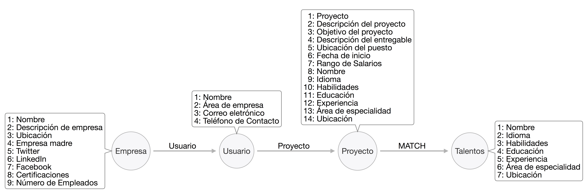
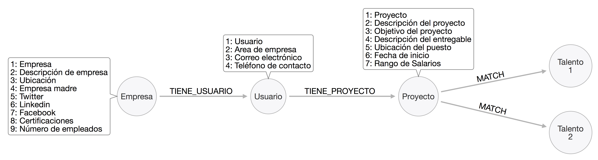
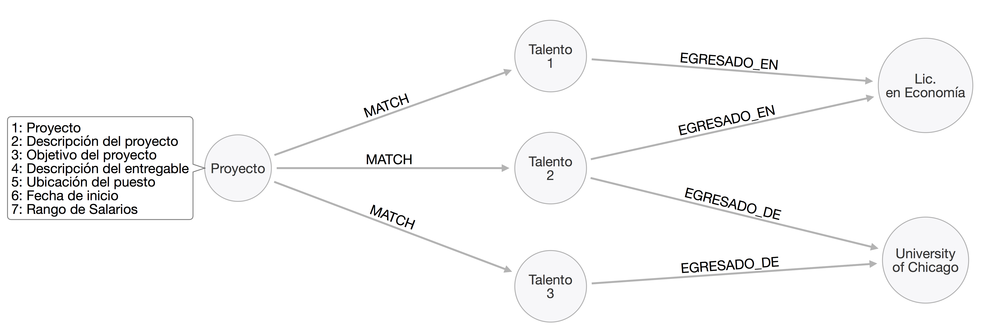
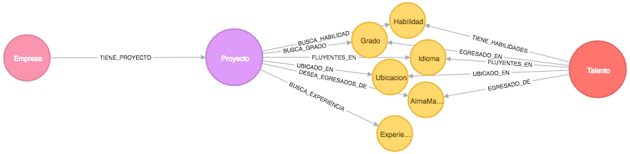
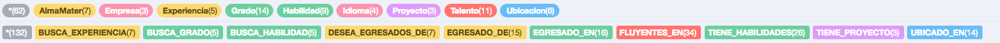
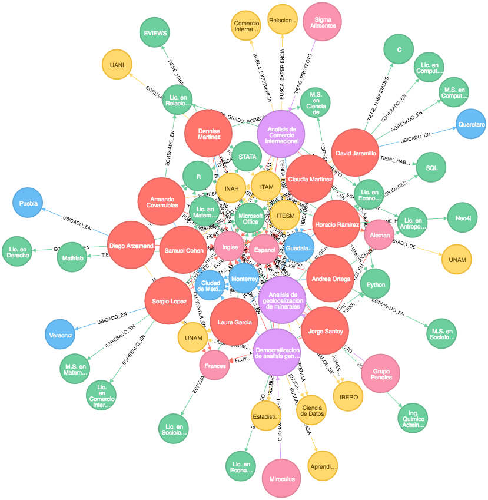
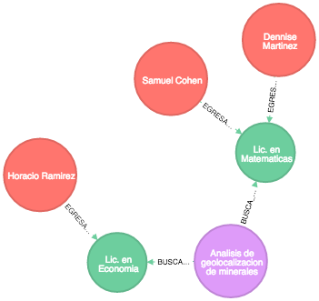
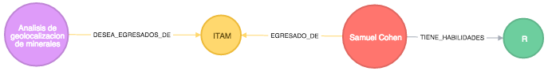
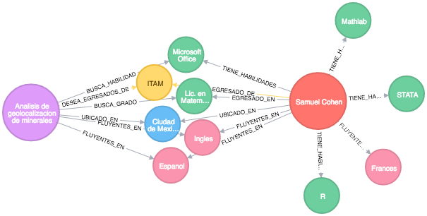

# Acercamiento Analítico 

En el capítulo anterior [Estructura de Bases de Datos] se revisaron los datos disponibles para el sistema de recomendación y se definió una nueva estructura de datos debido a que los datos presentados no eran suficientes para generar un sistema de recomendación basado en un **filtro colaborativo**. En los sistemas de recomendación basados en un filtro colaborativo es necesario determinar cómo individuos similares comparten atributos o características entre sí. Esto se hace comparando cada persona con el resto bajo el cálculo de un _score_ de similitud (distancia euclidiana, correlación de *Pearson*, algoritmos de aglomeración de *k-medias*). Esta aproximación analítica nos permite dar un mayor peso a ciertos características entre individuos. Por ejemplo, en este estudio pudieramos darle más peso a ciertas habilidades, áreas de especialidad y experiencia profesional indispensables para realizar un proyecto, y así poder generar un _ranking_ de recomendaciones con base a qué tan similares son los perfiles. Los sistemas de recomendación basados en un filtro colaborativo no solo dependen de encontrar a grupos de individuos similares sino de datos robustos que capturen un historial de las preferencias e intereses que tiene cada talento hacia los proyectos disponibles. Por esta y otras razones que no desarrollamos en este proyecto, decidimos explorar otras opciones considerando la falta de datos y lo que el solicitante del proyecto ha expresado que necesita. A continuación se detalla un alternativa para el desarrollo de sistemas de recomendación. Para mayor detalle sobre filtros colaborativos se puede consultar @Segaran:2007.


## Estructura de bases de datos de grafos

Una alternativa a los sistemas de recomendación con base en filtros colaborativos son aquellos basadaos en una **estructura interconectada de atributos** que comparten entre sí un conjunto de usuarios o artículos (items) para este caso en específico, puedieran ser tanto atributos de talentos como de proyectos. Este proyecto se desarrollará a partir de una **base de datos de grafos** debido a su capacidad para almacenar y representar bajo relaciones los elementos/observaciones a partir de sus atributos/propiedades. En contraste con una base de datos de grafos, las bases de datos relacionales (SQL) son muchas veces impedidas por la incapacidad de lectura a la hora  de conectar bajo **joints** datos intensamente relacionados entre tablas. En comparación con las bases de datos relacionales, las bases de datos de grafos son a menudo más rápidas y eficientes para los conjuntos de datos asociados (relacionadoes entre sí). Éstas pueden escalar más naturalmente a grandes volúmenes de datos, ya que normalmente no requieren costosas operaciones de *joints*. Como no dependen de un esquema rígido, son más adecuados para gestionar datos ad hoc y cambiantes con esquemas en evolución como lo pueden ser los datos de talentos y de proyectos [@Lal].

Organizar los datos en un espacio de grafos permite generar transacciones del tipo [OLTP](https://en.wikipedia.org/wiki/Online_transaction_processing) que son proveídas por su capacidad de almacenamiento y un motor de procesamiento que aventajan por la capacidad de leer (*to query*) cuando se trabaja con datos intrínsecamente realacionados [@graphdatabases]. 

Para este proyecto se ha propuesto utilizar [Neo4j](https://neo4j.com/product/) debido a la potencia que las bases de datos de grafos pueden proveer para los [sistemas de recomendación](https://neo4j.com/use-cases/real-time-recommendation-engine/). El objetivo es construir una base de datos de grafos a partir de sus atributos para almacenar y consultar información interconectada que partirá de las cuatro fuentes de datos señaladas en la seccion [Estructura de bases de datos]:


  * Empresa
  * Usuario
  * Proyectos
  * Talentos

  
A partir de éstas, se buscará interconectar las cuatro bases de datos a través de sus atributos que fungirán como interconectores entre ellas. De esta manera, las características/atributos de cada entrada en las bases de datos fungirán como insumos para un sistema de recomendación entre las empresas-proyectos y talentos como lo muestra la figura \@ref(fig:Figura1).


```{r Figura1, fig.cap= 'Representación de las relación que se obtendrá de cada una de las líneas de las bases de datos representadas en nodos, y que estarán conformada por los atributos (propiedades). En esta figura las propiedades se encuentran representados los cuadros adyacentes a cada nodo.', echo=FALSE, fig.retina = NULL}

```

## Sistema de Recomendación

Los algoritmos de recomendación buscan establecer sugerencias a través de relaciones entre individuos y otras personas, productos, servicios, contenidos u otros. Estas relaciones son establecidas principalmente con base en la conducta (o atributos) de los usuarios (proyectos) con lo que el algoritmo de busqueda puede indentificar probables fuentes de interes para estos (talentos).
Para este proyecto, se busca establecer un sistema de recomendación basado en usuario (*users based*), los cuales buscan identificar características/atributos de los usuarios específicas que permitan definir interés relacionados a éstos [@graphdatabases]. Por ejemplo, si un talento tiene experiencia en implementación de evaluaciones de impacto para políticas públicas, tiene un grado a nivel maestría de políticas públicas y tiene habiliades en diseños metodologicos de evaluación, asumiriamos que tuviera interés en proyectos que busquen estas mismas características. 

Una recomendación efectiva depende de un buen entendimiento y establecimiento de las relaciones o conexiones en él y lo recomendado, así como de la calidad y fuerza de éstas conexiones de la cuál, una de las mejores maneras de expresarlas es a través de un grafo de propiedades. Es por esto que los grafos se ajustan de manera idónea a las estructuras de datos densamente conectados. El almacenamiento y las consultas de estos datos bajo bases de datos de grafos permite a una aplicación emerger resultados en tiempo real que puedan reflejar cambios en datos de manera casi instantánea.
 
Es por esta razón que se propone abordar el sistema de recomendación  a través de un grafo multiple y heterogéneo (debido a que estará conformado por distintos tipos de nodos y relaciones) que permitirá interconectar la información y poder generar un *MATCH* entre proyectos y talentos como lo muestra la Figura \@ref(fig:Figura2).

```{r Figura2, fig.cap= 'Representación de una recomendación bajo el diseño de un grafo.', echo=FALSE, fig.retina = NULL}

```

La habilidad de poder generar una recomendación acertada, se basa en la capacidad de proponer la mejor  alternativa (talento) bajo los requerimientos que un proyecto determina; a partir de todas las características de un universo de talentos.


### Recomendaciones por grafos

Las recomendaciones se podrán establecer a partir de las relaciones (atributos) que compartan los proyectos y talentos como lo muestra la Figura \@ref(fig:Figura3) como por ejemplo:
  
  * Talentos que compartan una relación de **ALMA MATER**
  * Talentos que compartan una relación de **CARRERA**

```{r Figura3, fig.cap= 'Representación de una recomendación bajo el diseño de un grafo.', echo=FALSE, fig.retina = NULL}

```


## Construcción de base de datos de grafos

Debido a la inexistencia de datos actuales de talentos y proyectos, se propuso la creación de una **base de datos de ejemplo** para poder organizar el sistema de recomendación. De esta manera, se partió de dos bases de datos en csv: talentos y proyectos.

Si bien, ambas bases están compuesta por la totalidad de atributos propuestos en la sección [Entidades de datos solicitadas] solo se llenaron algunos campos definidos en la sección [Entidades de datos simuladas] para mostrar la efectividad y el desempeño del sistmea de recomendación.

El esquema de la base de datos de grafos busca interconectar las características de los proyectos con las características de los talentos para buscar aquellos que tengan mayor semejanza entre ellos y que se puedan convertir en candidatos para la empresas. Si bien, la interconexión de atributos entre empresa-talentos puede considerar hacer un **MATCH** bajo detalles tan minusculos como la fecha en que se tituló un candidato, la estructura de la **base de datos de ejemplo** sólo contempla atributos que los consideramos como "base" para la prueba de nuestro algoritmo: habilidades, grado, idiomas, ubicacion, alma mater, experiencia. En la Figura \@ref(fig:Figura4) muestra la estructura del meta-grafo:

```{r Figura4, fig.cap= 'Representación del esquema de meta base de grafos', echo=FALSE, fig.retina = NULL}

```

A partir de esta estructura, se procedió a generar la base de datos con tres proyectos propuestos y once talentos de los cuales pudieran hacer **MATCH** si existen coincidencias en los requirimientos. Se generaron 62 nodos y 132 relaciones entre estos, a pesar de que solo son menos de 15 entradas en las bases de datos. El grafo está compuesto por 9 distintos nodos (como lo muestra la anterior Figura \@ref(fig:Figura4) ) y 10 relaciones que conectan estos atrbutos entre sí.  A continuación se muestran los nodos y relaciones de nuestro base de datos en la Figura \@ref(fig:schema)

```{r schema, fig.cap= 'Referencia de Nodos y Relaciones', echo=FALSE, fig.retina = NULL}

```

De esta manera, es posible generar una visualización (Figura \@ref(fig:Figura5)) completa de esta base de datos. Esta visualización nos permite entender de mejor manera la importancia de una base de datos de grafos por su amplia conexión entre atributos que fungen como estructura para el sistema de recomendación.

```{r Figura5, fig.cap= 'Representación de conexiones entre atributos', echo=FALSE, fig.retina = NULL}

```

En esta figura se muestran conectadas todas los atributos/características, tanto de cada talento, como de cada proyecto. Si el atributo es más compartido entre un mayor númerode nodos, el algoritmo de diseño acomodará a ese nodo de manera en el centro del grafo. Por ejemplo, el atributo 'Inglés' se encuentra en el centro por que tanto los nodos de talento comparten esta caracterítica como los nodos de proyectos. De lo contrario, si los nodos son más 'únicos', se encuentran en la periferia. Es así que podemos observar que entre más alejados los proyectos del centro más dificil será para ellos hacer un **MATCH**, ya que buscan características que no tiene la mayoria de los demás nodos.


## Generando una recomendación (MATCH)

**Grado de Estudio**

Un primer **MATCH** se pudiera hacer para conectar proyectos que busquen solo una característica: **Grado**. 
Esta solicitud nos pudiera responder con un listado de personas que coincidan con ese atributo. Por ejemplo, si buscamos cualquier grado que coincida con estudios de Matemáticas o Economía, nuestro sistema de recomendación arroja:

```
MATCH (p:Proyecto {id: '2'} )
WHERE (p.grados CONTAINS 'Matematicas' OR p.grados CONTAINS 'Economia')
MATCH (p)-[:BUSCA_GRADO]->(g)<-[:EGRESADO_EN]-(t)
RETURN t.nombre, g.grados
```


```
[{'g.grados': 'Lic. en Matematicas', 't.nombre': 'Dennise Martinez'},
 {'g.grados': 'Lic. en Matematicas', 't.nombre': 'Samuel Cohen'},
 {'g.grados': 'Lic. en Economia', 't.nombre': 'Horacio Ramirez'}]
```

De manera visual, este **MATCH** se ve reflejado en el siguiente Figura \@ref(fig:Figura6)

```{r Figura6, fig.cap= 'MATCH por grado', echo=FALSE, fig.retina = NULL}

```


**Especialidad**

Si quisiermos hacer una **MATCH** por **Área de Especialidad** nuestra recomendación nos arrojaría lo siguiente:

```
MATCH (t: Talento)
WHERE (t.area CONTAINS 'Antropologia')
RETURN t.nombre, t.grados, t.area
```

```
[{'t.area': 'Antropologia Social',
  't.grados': 'Lic. en Antropologia,M.S. en Sociologia',
  't.nombre': 'Andrea Ortega'},
 {'t.area': 'Antropologia Social',
  't.grados': 'Lic. en Antropologia',
  't.nombre': 'Claudia Martinez'}]
```

**Instituciones y Habilidades**

Si quisiermos hacer un **MATCH** más robusto, pudieramos solicitar una combinación de atributos, como por ejemplo buscar personas que sean egresadas del ITAM y que además tengan habilidad en R como lo muestra la Figura  \@ref(fig:Figura7)


```{r Figura7, fig.cap= 'MATCH de institución de egreso (ITAM) y habilidad (R)', echo=FALSE, fig.retina = NULL}

```


**Conjunto de atributos**

El poder de este sistema es que nos permite encontrar un **MATCH** tan complejo como lo deseamos. En este caso se propone buscar a un talento que tengan entre sus grados algo relacionado con Computación o Matemáticas, que hayan sido egresados del ITAM, que este especializado en el Área de Ciencias Sociales, hablen inglés, vivan en la Ciudad de México y que tengan experiencia en temas de planeación. Por ejemplo:

```
MATCH (p:Proyecto) WHERE p.id = '2'
MATCH (t:Talento)
WHERE t.grados CONTAINS 'Ciencia de Datos' OR t.grados CONTAINS 'Computacion' OR t.grados CONTAINS 'Matematicas'
MATCH (p)-[:DESEA_EGRESADOS_DE]->(a:AlmaMater {almaMater: 'ITAM'})<-[:EGRESADO_DE]-(t)
WHERE t.area CONTAINS 'Ciencias Sociales' AND t.idiomas CONTAINS 'Frances' AND t.departamento CONTAINS 'Planeacion'
RETURN t.nombre, t.nacimiento, t.lugar
```

Nuestro **MATCH** nos arrojaría la siguiente información:
```
[{'t.lugar': 'Ciudad de Mexico',
  't.nacimiento': '09/12/87',
  't.nombre': 'Samuel Cohen'}]
```

Y visualmente pudieramos ver que para este proyecto haría un **MATCH** como lo muestra la Figura \@ref(fig:Figura8)

```{r Figura8, fig.cap= 'MATCH para un conjunto de atributos: tipo de grado, institución de egreso, especialidad, area, idioma y ubicación', echo=FALSE, fig.retina = NULL}

```

La definición de una estructura de **bases de datos de grafos** permite tener muchas ventajas para la implementación y escalamiento de una arquitectura de productos de datos. El sistema de recomendación diseñado a partir de esta estructura-esquema de una base de datos de grafos permite facilitar la producción de este sistema, ya que una de sus ventajas es omitir los procesos de optimización de una métrica en especifico como lo puede ser un score de similitud. La propuesta de crear una estructura interrelacionada permite generar un sistema de recomendación basado en las propiedades definadas como atributos de los objetos a recomendar. 
Como el sistema de recomendación se basa en la estructura de la consulta (*query*), es importante establecer una base completa, exhaustiva y con un gran número de entradas para mejorar la probabilidad generar un **MATCH** entre proyectos y talentos. 

Conviene mencionar que el sistema de recomendación se puede fortalecer a medida que tengamos más información para incorporar rankings. En el siguiente capítulo [Arquitectura de Producto de Datos](#dpa) revisaremos cómo se implementará el sistema de recomendación, específicando el flujo de operación, la infraestructura y ejemplos de consultas.
