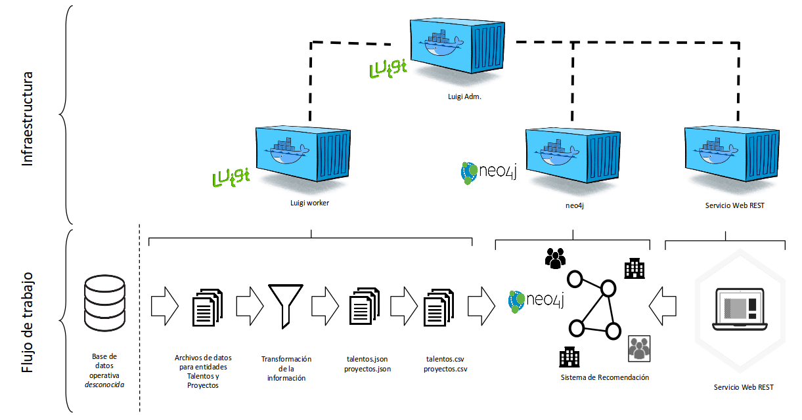
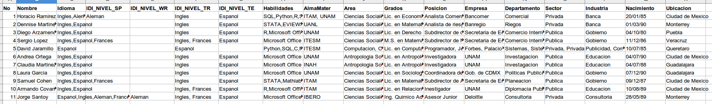
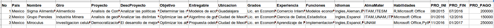
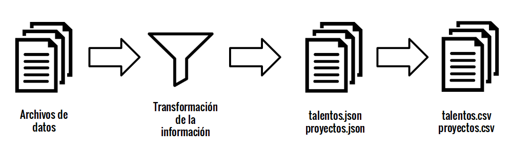
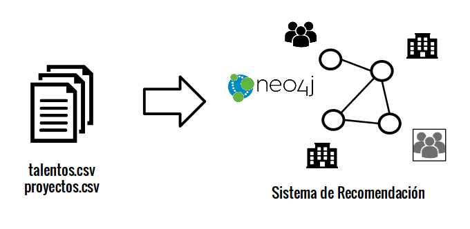
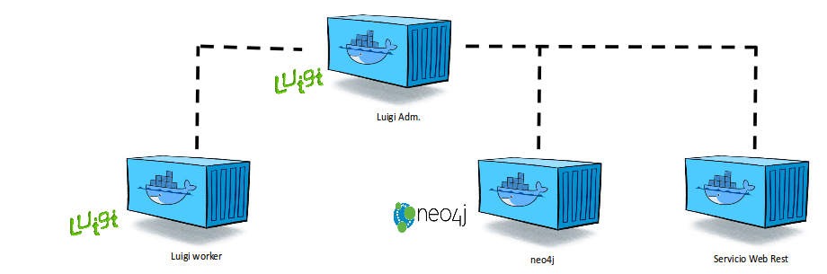
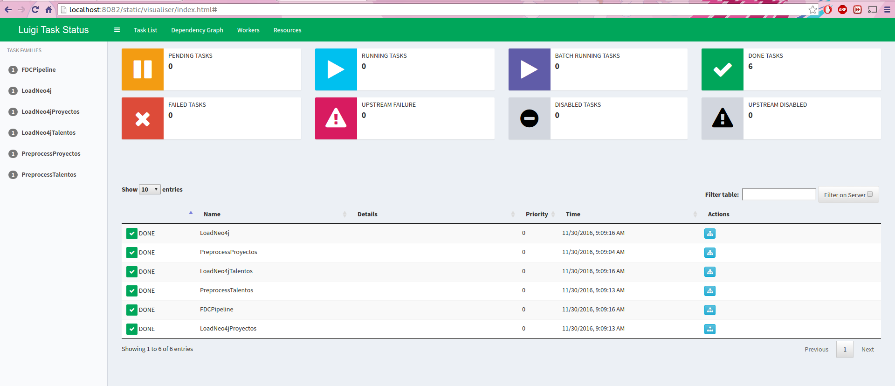
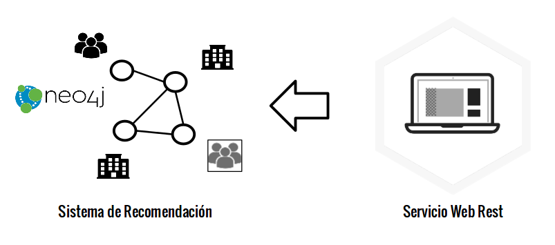
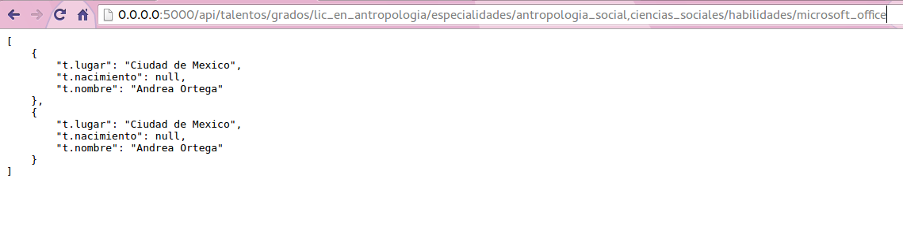

# Arquitectura de Producto de Datos {#dpa}

## Estructura general

En el capítulo anterior [Acercamiento Analítico] se describió la metodología del sistema de recomendación. En este capítulo se describe la arquitectura de producto de datos compuesta tanto por un flujo de trabajo (*pipeline*) y la infraestructura requerida. Partiendo de la existencia de una base de datos operativa que funciona de acuerdo con las necesidades del negocio, el siguiente diagrama \@ref(fig:flujoyarquitectura) muestra el flujo de trabajo desde la ingesta de datos hasta las recomendaciones, junto con la infraestructura requerida:

```{r flujoyarquitectura, fig.cap= 'Diagrama de la infraestructura y el flujo de datos', echo=FALSE, fig.retina = NULL}

```


El flujo operativo (pipeline) se compone de los siguientes pasos:

1. Se ingestan los datos desde la base de datos operativa **desconocida**.
2. La base de datos operativa se almacenará en archivos.
3. Se realizan operaciones de transformación en los datos y estos se almacenan como archivos ```json```.
4. Estos archivos se transformarán en un archivo útil para la ingesta de una base de datos de grafos.
5. Estos archivos se ingestarán a la base de datos de grafos de acuerdo al modelo descrito en el capítulo 4 —[Acercamiento Analítico].

El pipeline se llevará a cabo a través de una infraestructura de contenedores Docker, cada uno cumplirá cada con ciertas funciones que se describen más adelante en [Infraestructura]. A continuación se describe con detalle la ingesta de datos.

## Ingesta de Datos

La ingesta de datos es el proceso que permite mover, transformar y entregar los datos para que estos sean analizados en una etapa posterior. La dividimos en dos pasos:

(1) Obtención de datos
(2) Transformación

La **obtención de datos** consiste en la extracción de los mismos a partir de las bases de datos operativa. Este proceso no está incluido en este trabajo por que depende fuertemente de la estructura de la base de datos operativa.

Como se comentó en el capítulo 3 —[Estructura de Bases de Datos], el solicitante no tenía una base de datos operativa, por lo que fue imposible realizar la fase de extracción de datos desde dicha base. Para continuar con el proyecto creamos dos entidades de datos de ejemplo: Talentos \@ref(fig:talentos) y Proyectos \@ref(fig:proyectos). Estas entidades fueron creadas con los campos que consideramos más importantes para un sistema de recomendación especificadas en la sección [Entidades de datos simuladas], a partir de las cuales se crearon 11 registros de Talentos y 3 registros de Proyectos.

```{r talentos, fig.cap= 'Ejemplo de entidad de Talentos', echo=FALSE, fig.retina = NULL}

```


```{r proyectos, fig.cap= 'Ejemplo de entidad de Proyectos', echo=FALSE, fig.retina = NULL}

```

Partiendo de las entidades Talentos y Proyectos de ejemplo, transformamos la información a ocho archivos:

1. educación.tsv
2. habilidades.tsv
3. trabajo.tsv
4. idioma.tsv
5. otros.tsv
6. person.tsv
7. proyecto_info.tsv
8. proyecto_talentos.tsv

Los primeros seis archivos contienen información de los talentos y los últimos dos de proyectos.

La **transformación** de los datos es el proceso que implica la homologación de datos y agrupación de los mismos. Esto nos arrojará como resultado un conjunto de datos organizados y separados de acuerdo a las necesidades del sistema de recomendación, como se puede ver en la Figura \@ref(fig:ingesta2).

```{r ingesta2, fig.cap= 'Paso de transformación', echo=FALSE, fig.retina = NULL}

```

En este paso los archivos .tsv se transformaron a una estructura .json y trabajamos en la definición de los nombres técnicos de los campos según lo descrito en el Apéndice [Entidades de datos simuladas]. Dado que el solicitante contaría con catálogos no fue necesario crear la fase de limpieza y homologación de datos a detalle. En los campos en los que existía la posibilidad de tener más de un dato, se separan los datos dentro del campo por medio de una coma (,) partiendo de la más antigua a la más reciente. Estos campos pueden ser idiomas, habilidades, instituciones educativas, áreas educativas, grados o títulos acádemicos obtenidos, posiciones de trabajo, empresas de trabajo, áreas de trabajo, tipo de empresas, entre otras. Posteriormente cada estructura se almacenaron en formato .csv en la carpeta `/import` para ser ingeridos por el sistema de recomendación. 


## Estructuración de la Base de Datos de Grafos

La base de datos de grafos se crea a partir de los archivos .csv creados en la fase anterior de ingesta en conjunto con un esquema de nodos-relaciones de acuerdo al sistema de recomendación diseñado en el capítulo anterior. La definición de relaciones entre las propiedades de los nodos (e.g. empresa $\to$ proyecto $\to$ talento, etc.) determina el alcance del sistema de recomendación.

```{r ingesta3, fig.cap= 'Estructuración de la Base de Datos de Grafo', echo=FALSE, fig.retina = NULL}

```


## Infraestructura

La infraestructura del proyecto se compone de cuatro contenedores Docker para realizar las siguientes funciones:

```{r dockers, fig.cap= 'Contenedores dockers requeridos para el pipeline', echo=FALSE, fig.retina = NULL}

```

1. **Luigi Administrador**: se encargará de orquestar las actividades del flujo operativo.
2. **Luigi Worker**: realizará la obtención, transformación y estructuración de las base de datos de grafos. 
3. **Neo4j**: aplicación donde vive el sistema de recomendación.
4. **Servicio Web REST**: módulo para consultar al sistema de recomendación.


Las aplicaciones que empleamos en la infraestructura:

* [**Docker**](https://www.docker.com/) para realizar el flujo es necesario trabajar con contenedores de Docker los cuales almacenan programas, código, librerías, entre otros, dando la libertad de "correr" sin importar el ambiente o infraestructura en el que se trabaje. Esto es muy importante dado que al trabajar con distintos sistemas operativos como lo son Linux y Windows se generan problemas de compatibilidad, sin embargo Docker puede ser montado sobre distintas plataformas. Entre otras ventajas de Docker destacan el poco uso de memoria RAM y que cada contenedor puede correr aplicaciones de manera independiente con la posibilidad de conectarse para cumplir distintas funciones del flujo de trabajo.

- [**Luigi**](https://github.com/spotify/luigi) es un paquete de Python, que asiste en la elaboración de complejos flujos de datos ayudando en el manejo de resolución de dependencias, administración de flujos de trabajo, manejo de fallas, entre otros. Esto permite unir diferentes tareas en el proceso de ingesta de datos, asi como automatizarlas y controlar las fallas cuando ocurren.

- [**Neo4J**](https://neo4j.com/) es una base de datos de grafos escalable que permite la implementación de modelos de datos basados en objeto $to$ relacion $to$ objeto (tripletas), en donde cada elemento, puede tener propiedades y estas pueden ser indexables para su rápida consulta @graphdatabases. Neo4j, a través de índices-libres y relaciones bidireccionales, reduce el costo de la búsqueda de información. Los registros de nodos almacenan apuntadores a listas de relaciones, etiquetas y propiedades. Mientras que los registros de relaciones almacenan el ID de los nodos de inicio y final de cada relación, un apuntador del tipo de relación, apuntadores de los registros de la relación previa y próxima de cada uno de los nodos de inicio y final, y una bandera indicando si el registro en cuestión es el primero.^[Para mayor información consultar "Chapter 6: Graph Database Internals" del libro [@graphdatabases].]

Las **librerías y programas** instaladas en los contenedores:

1. Lenguaje de programación Python versión: 3.5.4
2. Librerías de Python: py2neo, Flask, luigi, pandas, numpy.


## Orquestación del Pipeline
Los pasos de preprocesamiento y carga a Neo4j son manejados por medio de un pipeline de `luigi`, el cual está contenido en la carpeta `/etl` del repositorio. El archivo principal, `pipeline.py`, solamente contiene la instrucción de ejecución del pipeline y la última tarea a realizar: `LoadNeo4j`, tarea que contiene instrucciones para la carga a Neo4j de ambas bases: `LoadNeo4jTalentos` y `LoadNeo4jProyectos`. Esta tarea depende a su vez de `PreprocessData`, la cual contiene los pasos de limpieza y transformación de los datos a un formato amigable para la base de datos de grafos. Podemos consultar el proceso en la Figura \@ref(fig:flujopipeline).


```{r flujopipeline, fig.cap= 'Pipeline de ETL', echo=FALSE, fig.retina = NULL}
knitr::include_graphics("figures/flujo_pipeline.png")
```

La tarea `PreprocessData` ejecuta dos dependencias: `PreprocessTalentos` y `PreprocessProyectos`. De esta manera, el proceso de transformación se aplica tanto a la base de datos de Talentos como a la de Proyectos.

Una vez que las entidades de Talentos y Proyectos están en el formato `.csv` en la carpeta `/import`, se cargan a *neo4j* mediante la tarea `LoadNeo4j`. De manera similar a la tarea de preprocesamiento, se ejecutan dos dependencias: `LoadNeo4jTalentos` y `LoadNeo4jProyectos` respectivamente para cada entidad. Cada una de estas tareas ingesta el archivo `.csv` correspondiente, y asigna las relaciones y propiedades relevantes a cada entidad. Un ejemplo sería, para los Proyectos:

```
(p)-[:DESEA_EGRESADOS_DE]->(a)
```

Y para los talentos:

```
(t)-[:EGRESADO_DE]->(a)
```

Es importante notar que, por medio de una serie de restricciones de unicidad en los nodos, en esta etapa nos aseguramos que no se dupliquen registros.

La salida final del pipeline de ETL es un grafo único cuyos nodos tienen distintas relaciones y propiedades descritas en el capítulo 4 [Acercamiento Analítico], el cual es la base de nuestro sistema de recomendación. 

El flujo de trabajo se orquestado a través de Luigi tiene una interfaz que muestra el estatus de nuestras tareas como se muestra a continuación en la Figura \@ref(fig:flujoluigi)


```{r flujoluigi, fig.cap= 'Interfaz del Flujo de Trabajo en Luigi', echo=FALSE, fig.retina = NULL}

```


## Servicio Web REST

La consulta de la información contenida en la base de datos de grafos se realiza mediante servicios Web REST. Como parte del proyecto, se desarrollaron cuatro metodos que permiten hacer consultas por __habilidades__, __especialidades__, __grados__ y la mezcla de los anteriores. La lista de los metodos expuestos son los siguientes:

<h3>Operaciones</h3>
|                                          Ruta                                         	| Descripción                                                                             	|
|-------------------------------------------------------------------------------------	|-----------------------------------------------------------------------------------------	|
| /                                                                                     	| Nombre del proyecto                                                                     	|
| /api                                                                                  	| Version del api                                                                         	|
| /api/talentos/grados/*:grado*                                                         	| el parámetro de entrada es el grado y puede especificarse una lista separada por comas. 	|
| /api/talentos/especialidades/*:especialidad*                                          	| El parámetro de entrada puede especificarse como lista separando por comas.             	|
| /api/talentos/habilidades/*:habilidad*                                                	| El parámetro de entrada puede especificarse como lista separando por comas.             	|
| /api/talentos/grados/*:grado*/especialidades/*:especialidad*/habilidades/*:habilidad* 	| Cada parámetro de entrada puede especificarse como lista separando por comas.           	|


El usuario consulta a través de un _request_ especificando las variables y valores, que son los parámetros que definen el _query_. El _response_ regresa el resultado de dicha consulta como se se muestra en la Figura \@ref(fig:ingesta4). Algunos ejemplos de consultas que puede tener este módulo son por grados o título acádemico, área de especialidad, tipo de industria, institución educativa, habilidades, entre otros.

```{r ingesta4, fig.cap= 'Servicio Web', echo=FALSE, fig.retina = NULL}

```

Un ejemplo de consulta se muestra en la siguiente Figura \@ref(fig:consulta) 

```{r consulta, fig.cap= 'Ejemplo de consulta API', echo=FALSE, fig.retina = NULL}

```


En este capítulo describimos cómo fue el flujo de trabajo de nuestro sistema de recomendación, la infraestructura, la orquestación del pipeline y el servicio web REST. En el siguiente capítulo [Conclusiones] valoramos el funcionamiento de la arquitectura del producto de datos.
