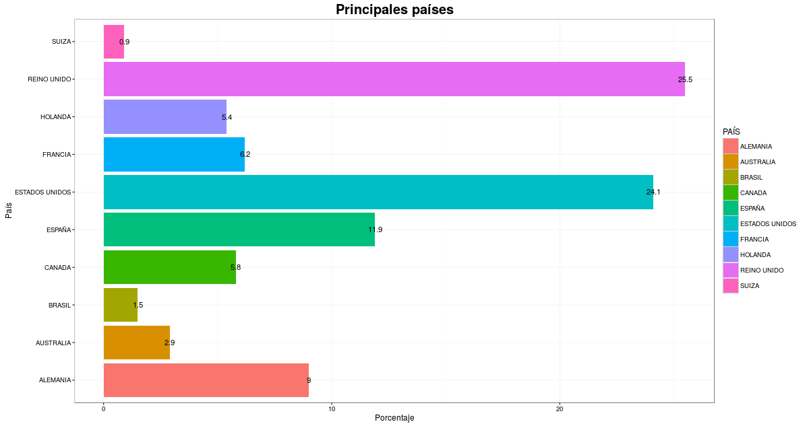
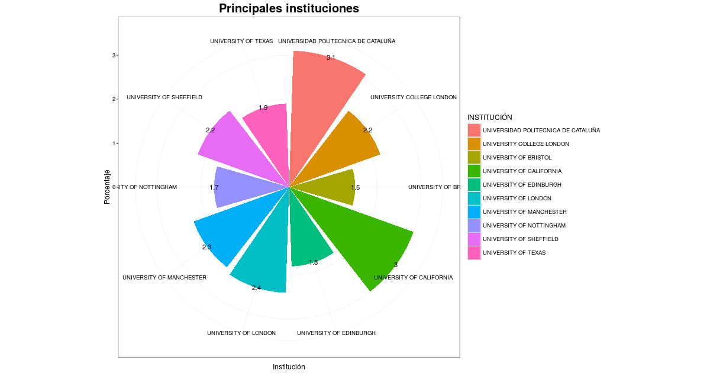
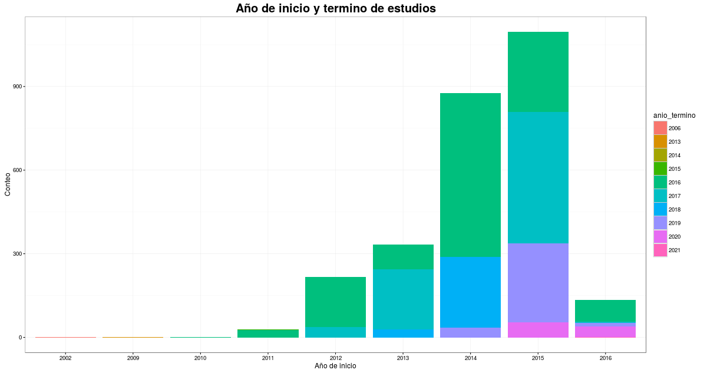
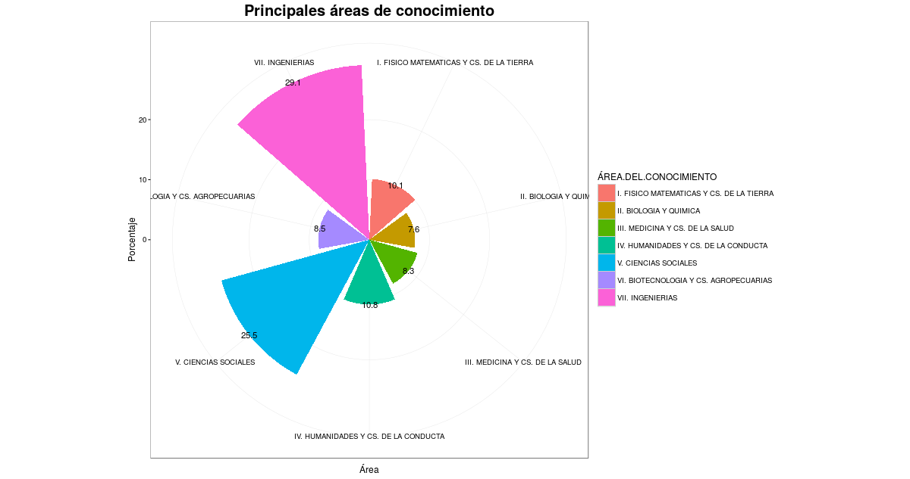
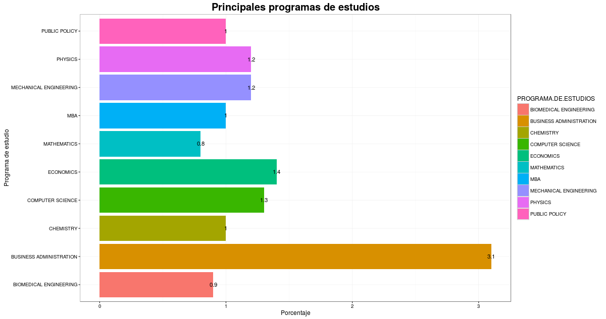

# (APPENDIX) Apéndice{-}

# Análisis Exploratorio {#eda}

Se realizó un análisis exploratorio a la base de datos `Padrón de Becarios al Extranjero CONACyT 2010-2016.xlsx`, la cual cuenta con 5,422 registros de estudiantes becados por el CONACyT que iniciaron sus estudios en 2002, y de 2009 a 2016. Entre las principales estadísticas destacan:

Los destinos preferidos por los becarios para cursar sus estudios son Reino Unido (25.5%), Estados Unidos (24.1%) y España (11.9%), para mayor detalle ver Figura \@ref(fig:principalespaises).

```{r principalespaises, fig.cap= 'Principales países de estudio preferidos por becarios CONACyT', echo=FALSE, fig.retina = NULL}

```


Las instituciones en las que estudian los becarios presentan una gran dispersión, sin embargo las que tienen mayor concentración son la **Universidad Politécnica de Cataluña**(3.1%), la **Universidad de California** (3.0%) y **University of London** (2.4%), para mayor detalle ver Figura \@ref(fig:principalesinstituciones).

 ```{r principalesinstituciones, fig.cap= 'Principales instituciones de estudio preferidas por becarios CONACyT', echo=FALSE, fig.retina = NULL}

```

El 51% de las becas fueron otorgadas para estudios de doctorado, el 48.8% para maestría y el 0.2% para una especialidad o estancia técnica.
  
  
Como se muestra en la Figura \@ref(fig:anioiniciotermino) de los 5,422 registros que contiene la base de datos, se muestra que en el 2016 se dio inicio a la beca del 6.0% de los estudiantes, en 2015 del 47.1%, en 2014 del 27.0%, 2013 del 11.4%, 2012 del 7.0%, 2011 del 1.3% y en 2002, 2009 y 2010 del 0.07%.

 ```{r anioiniciotermino, fig.cap= 'Distribución de becas CONACyT a través del tiempo', echo=FALSE, fig.retina = NULL}

```

El 41.1% de los becados son de género femenino y el 58.9% masculino.
  
El importe promedio entre enero y marzo de 2016 fue de 84,256 por estudiante becado. Según el nivel de estudio, el importe promedio pagado a estudiantes de doctorado fue de $86,346, de maestría $82,214, de especialidad $46,536 y de estancia técnica $97,551.

Las Ciencias Sociales e Ingenierías son las principales áreas de conocimiento becadas por CONACyT, para mayor detalle ver Figura \@ref(fig:areasconocimiento).
  
```{r areasconocimiento, fig.cap= 'Principales áreas de conocimiento de becarios CONACyT', echo=FALSE, fig.retina = NULL}

```

El programa de estudios presenta una gran dispersión, sin embargo descata _Business Administration_, seguido de _Economics_ y de _Computer Science_, para mayor detalle ver Figura \@ref(fig:principalesprogramas).

```{r principalesprogramas, fig.cap= 'Programas de estudio de becarios CONACyT', echo=FALSE, fig.retina = NULL}

```


# Entidades de datos solicitadas {#entidades}

Como se comentó en el Capítulo 3 [Estructura de Bases de Datos], se solicitaron las siguientes seis entidades de datos:


Table:(\#tab:tabla-talentos) Tabla Talentos

| Entidad                                        | Subcampo                 | Variables                |
|------------------------------------------------|--------------------------|--------------------------|
| Talentos                                       | Publicaciones            | Identificador único      |
|                                                |                          | Título                   |
|                                                |                          | Publicación              |
|                                                |                          | Autores                  |
|                                                |                          | Fecha                    |
|                                                |                          | URL                      |
|                                                |                          | Resumen                  |
|                                                | Patentes                 | Identificador único      |
|                                                |                          | Título                   |
|                                                |                          | Resumen                  |
|                                                |                          | Descripción del status de la patente |
|                                                |                          | Institución que emitió la patente |
|                                                |                          | Nombre de los inventores |
|                                                | Idiomas                  | Nombre del idioma        |
|                                                |                          | Nivel (elemental, limitado, profesional, nativo) |
|                                                | Habilidades              | Habilidades blandas (_soft skills_)   |
|                                                |                          | Habilidades duras (_hard skills_)   |
|                                                | Certificaciones          | Nombre de la certificación |
|                                                |                          | Autoridad que expidió la certificación |
|                                                |                          | Número                   |
|                                                |                          | Fecha de Inicio          |
|                                                |                          | Fecha de Finalización    |
|                                                | Educación                | Nombre de la institución |
|                                                |                          | Área de estudio          |
|                                                |                          | Fecha de Inicio          |
|                                                |                          | Fecha de Finalización    |
|                                                |                          | Título                   |
|                                                |                          | Actividades en las que participó durante la escuela |
|                                                | Cursos                   | Nombre                   |
|                                                |                          | Resumen                  |
|                                                |                          | Institución              |
|                                                |                          | Fecha                    |
|                                                | Trabajo/Voluntariado     | Tíulo de la posición     |
|                                                |                          | Resumen                  |
|                                                |                          | Fecha de Inicio          |
|                                                |                          | Fecha de Finalización    |
|                                                |                          | ¿Es trabajo vigente? (Sí / No)|
|                                                |                          | Nombre de la Empresa     |
|                                                |                          | Área                     |
|                                                |                          | Tipo: (Pública / Privada) |
|                                                |                          | ¿Voluntariado? (Sí / No) |
|                                                |                          | Industria                |
|                                                | Información Adicional    | Fecha y hora de última modificación  |
|                                                |                          | Asociaciones de las que es miembro   |
|                                                |                          | Intereses                |
|                                                |                          | Honores o premios recibidos
|                                                |                          | Fecha de nacimiento      |
|                                                |                          | Números teléfonicos      |
|                                                |                          | Dirección principal (puede ser trabajo, casa u otra)|
|                                                |                          | Cuenta de Facebook       |
|                                                |                          | Cuenta de Twitter        |
|                                                |                          | Cuenta de Github         |
|                                                |                          | Página Web               |
|                                                |                          | Ubicación                |


Table:(\#tab:tabla-empresas) Tabla Empresas

| Entidad                                        | Variables                |
|------------------------------------------------|--------------------------|
| Empresas                                       | País                     |
|                                                | Nombre                   |
|                                                | Giro                     |
|                                                | Descripción Empresa      |
|                                                | Ubicación                |
|                                                | Empresa Matriz           |
|                                                | Ubicación Empresa Matriz |
|                                                | Rango de número de empleados |
|                                                | Cuenta Linkedin          |
|                                                | Cuenta Facebook          |
|                                                | Cuenta Twitter           |
|                                                | Página Web               |
|                                                | Teléfono                 |
|                                                | Certificaciones          |


Table:(\#tab:tabla-info-proyecto) Tabla Información del Proyecto

| Entidad                                        | Variables                |
|------------------------------------------------|--------------------------|
| Información del Proyecto                       | Nombre                   |
|                                                | Descripción              |
|                                                | Objetivo                 |
|                                                | Descripción del Entregable |
|                                                | Ubicación donde se desempeñaría el proyecto |
|                                                | Fecha de Publicación     |
|                                                | Fecha de Inicio          |
|                                                | Fecha de Finalización Estimada (Validez) |
|                                                | Pago (opcional)          |


Table:(\#tab:tabla-perfiles-proyecto) Tabla Perfiles que Requiere el Proyecto

| Entidad                                        | Variables                |
|------------------------------------------------|--------------------------|
| Perfiles que Requiere el Proyecto              | Nombre                   |
|                                                | Descripción              |
|                                                | Funciones                |
|                                                | Requerimentos del Puesto |


Table:(\#tab:tabla-consultor) Tabla Usuario del Consultor Empresa

| Entidad                                        | Variables                |
|------------------------------------------------|--------------------------|
| Usuario del Consultor Empresa                  | Nombre                   |
|                                                | Empresa                  |
|                                                | Área                     |

Table:(\#tab:tabla-interaccion) Tabla Interacción del Usuario Consultor y Talento 

| Entidad                                        | Variables                |
|------------------------------------------------|--------------------------|
| Interacción del Usuario Consultor y Talento    | Perfiles Recomendados    |
|                                                | Perfiles Contactados     |
|                                                | Perfiles a los que se hizo una oferta |
|                                                | Aceptación de Becario    |
|                                                | Aceptación de Consultor  |


# Entidades de datos simuladas

Como se comentó en el Capítulo 5 [Arquitectura de Producto de Datos], se simularon las entidades de datos de Talentos y Proyectos. Las entidades continen los siguientes campos:

Table:(\#tab:tabla-talentos-ejemplo) Tabla Talentos de Ejercicio de Ejemplo

| Entidad                                        | Subcampo                 | Variables                | Nombre técnico |
|------------------------------------------------|--------------------------|--------------------------|----------------|
| Talentos                                       |                          | Identificador único talento  |    ID |
|                                                |                          | Nombre                   | ID_NOMBRE      |
|                                                | Idiomas                  | Nombre del idioma        | IDI_NOMBRE |
|                                                |                          | Nivel (hablado, escrito, traductor, técnico) | IDI_NIVEL_SP, IDI_NIVEL_WR,	IDI_NIVEL_TR, IDI_NIVEL_TE |
|                                                | Habilidades              | Habilidades              |                |
|                                                | Educación                | Nombre de la institución | EDU_INST       |
|                                                |                          | Área de estudio          | EDU_AREA       |
|                                                |                          | Título                   | EDU_TITULO     |
|                                                | Trabajo/Voluntariado     | Tíulo de la posición     | TRA_POSICION   |    
|                                                |                          | Nombre de la Empresa     | TRA_EMPRESA    |
|                                                |                          | Área                     | TRA_AREA       |
|                                                |                          | Tipo: (Pública / Privada) | TRA_TIPO      |
|                                                |                          | Industria                | TRA_IND        |
|                                                | Información Adicional    | Ubicación                | INF_UBICACION  |


Table:(\#tab:tabla-proyectos-ejemplo) Tabla Talentos de Proyectos de Ejemplo

| Entidad    | Variables                    | Nombre técnico | 
|------------|------------------------------|----------------|
| Proyectos  | Identificador único          | PRO_ID         |
|            | País                         | PRO_PAIS       |
|            | Nombre                       | PRO_NOMBRE     |
|            | Giro                         | PRO_IND        |
|            | Proyecto                     | PRO_PROY       |
|            | Descripción                  | PRO_DESC       |
|            | Objetivo                     | PRO_OBJ        |
|            | Entregable                   | PRO_ENTR       |
|            | Ubicación                    | PRO_UBIC       |
|            | Grados de Educación          | PRO_TITULO     |
|            | Experiencia                  | PRO_EXP        |
|            | Funciones                    | PRO_FUNCIONES  |
|            | Idiomas                      | PRO_IDIOMAS    |
|            | Instituciones Educativas     | PRO_INST       |
|            | Habilidades                  | PRO_HABILIDADES |
|            | Fecha de inicio              | PRO_INI        |
|            | Fecha de entrega             | PRO_FIN        |
|            | Pago                         | PRO_PAGO       |


# Bitácora de comunicación


Table:(\#tab:tabla-bitacora) Bitácora de Comunicación

| Semana                        | Descripción                                                                 | 
|-------------------------------|-----------------------------------------------------------------------------|
| 8-12 ago 2016              | Recepción de base de datos de becarios CONACyt                              | 
|                               | Primera reunión entre el solicitante y equipo ITAM                          |
|                               | Primera reunión entre el solicitante y equipo ITAM                          | 
| 29 ago -2 sep 2016   | Segunda reunión entre el solicitante y equipo ITAM                          |
| 12-16 sep 2016         | Tercera reunión entre el solicitante y equipo ITAM                          |
|                               | Envío de del diseño de base de datos requeridos                             |
| 14 sep 2016            | Equipo ITAM da acceso al solicitante del proyecto al repositorio de Github |
| 19-23 sep 2016         | Recepción del diagrama Entidad-Relación  |
|                               | Solicitud relación entre base de datos operativa y análitica y la lista de entregables del ITAM a CONACyT |
| 10-14 oct 2016            | Recepción de relación entre base de datos operativa y análitica  |
| 24-28 oct  2016            | Solicitud de aclaración de inconsistencias en la relación entre base de datos operativa y análitica, y diccionario de la base de datos operativa y el formato de cada campo. |
|                               | Recepción de requerimientos por parte del solicitante para el sistema de recomendación (especialidad, experiencia, habilidades)
| 7-11 nov 2016           | Recepción de dudas sobre el sistema de recomendación |
|                               | Recepción de catálogos de áreas, habilidades e instituciones acádemicas |
| 14-18 nov 2016          | Envio de respuestas a las dudas sobre el sistema de recomendación del solicitante  |


